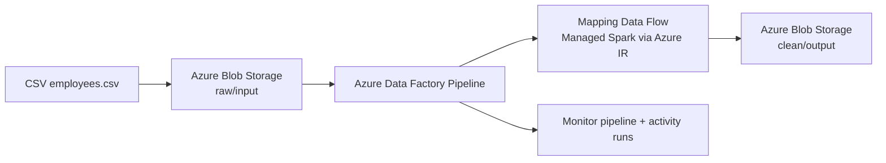
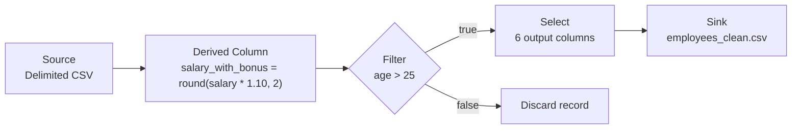
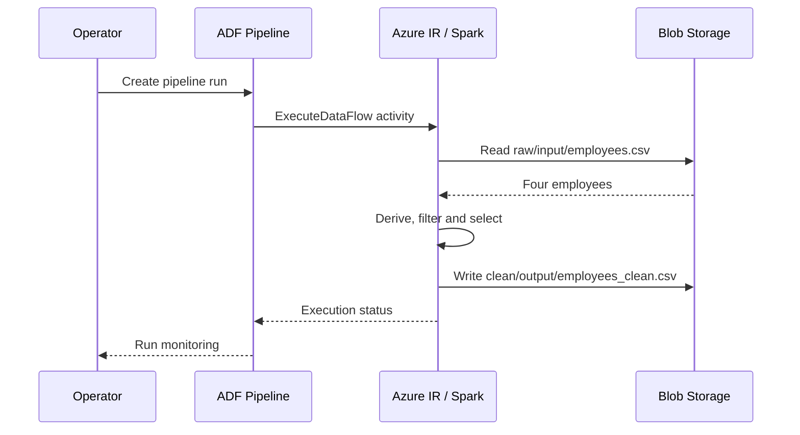

# Architecture and Logic Diagrams

## Azure resources

```mermaid
flowchart LR
    A["CSV employees.csv"] --> B["Azure Blob Storage<br/>raw/input"]
    B --> C["Azure Data Factory Pipeline"]
    C --> D["Mapping Data Flow<br/>Managed Spark via Azure IR"]
    D --> E["Azure Blob Storage<br/>clean/output"]
    C --> M["Monitor pipeline + activity runs"]
```

## Mapping Data Flow

```mermaid
flowchart LR
    S["Source<br/>Delimited CSV"] --> D["Derived Column<br/>salary_with_bonus = round(salary * 1.10, 2)"]
    D --> F{"Filter<br/>age > 25"}
    F -->|"true"| C["Select<br/>6 output columns"]
    F -->|"false"| X["Discard record"]
    C --> K["Sink<br/>employees_clean.csv"]
```

## Control vs data plane

```mermaid
sequenceDiagram
    participant U as Operator
    participant A as ADF Pipeline
    participant IR as Azure IR / Spark
    participant B as Blob Storage
    U->>A: Create pipeline run
    A->>IR: ExecuteDataFlow activity
    IR->>B: Read raw/input/employees.csv
    B-->>IR: Four employees
    IR->>IR: Derive, filter and select
    IR->>B: Write clean/output/employees_clean.csv
    IR-->>A: Execution status
    A-->>U: Run monitoring
```
